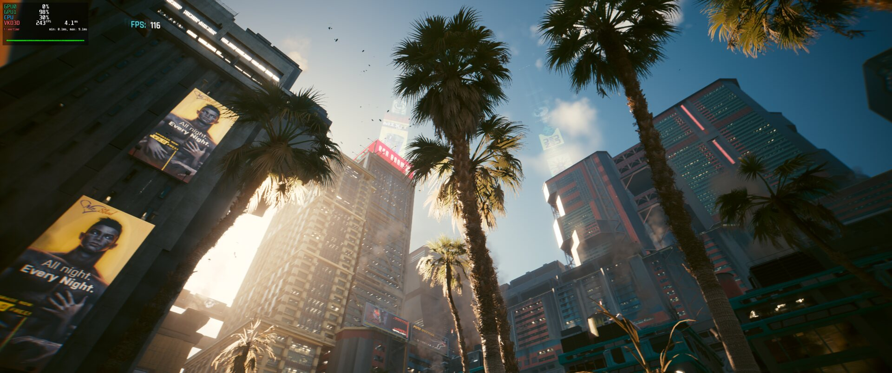

# AMD Fluid Motion Frames on Linux (afmf-linux)

[](https://github.com/serialexperimentslainnnn/afmf-linux/actions/workflows/ci.yml)
[](https://github.com/serialexperimentslainnnn/afmf-linux/releases/latest)
[](LICENSE)
[](https://afmf-linux.digitalexperiments.dev/)

**afmf-linux** is an open-source **frame generation layer for Linux gaming**: the equivalent of
**AMD Fluid Motion Frames (AFMF)** as a Vulkan implicit layer (`VK_LAYER_AFMF`). It generates one
interpolated frame between every two frames a game presents, from the colour buffer alone, so the
frame rate on screen doubles. No game integration, no kernel module, no Mesa or driver patch: it
works with any 64-bit Vulkan application, including **DirectX games under Proton** (DXVK,
vkd3d-proton) and native Linux titles, on **RADV / AMD RDNA** GPUs and, in principle, any Vulkan
driver.

AMD's AFMF is not a hardware feature: on Windows it is compute-shader work the driver inserts at
present time. This layer does the same thing on Linux, with AMD's own **FidelityFX Optical Flow**
shaders for the motion estimation, a small interpolation shader of its own, and the same
half-frame pacing AMD uses for AFMF, so the generated frames land evenly between the real ones.

**Documentation, install guide, configuration and measured numbers:**
<https://afmf-linux.digitalexperiments.dev/>

## Status

**Tested on: AMD Radeon RX 9070 XT (RDNA4) and RX 7800 XT (RDNA3)**, Mesa 26.1.8 RADV, Fedora 44,
KDE Plasma Wayland, 3440x1440 at 165 Hz, with Monster Hunter Wilds and Cyberpunk 2077 under
vkd3d-proton.

Developed and measured on the RX 9070 XT. On screen with the layer at 3440x1440: Monster Hunter
Wilds max + RT Native AA **265 fps** (120 without), Cyberpunk 2077 RT Ultra FSR Quality **243**
(116 real per the game's counter), DOOM: The Dark Ages Ultra Nightmare **268**, Overwatch 2 Epic
**449** (223 real), Borderlands 4 Badass **125**. The [screenshots](https://afmf-linux.digitalexperiments.dev/screenshots/)
page has each capture with its settings and launch options.

[](docs/assets/screenshots/cyberpunk-2077-rt-ultra-fsr-quality-5-full.jpg) In Monster Hunter Wilds (vkd3d-proton) it takes 120 real fps to ~250 on
screen with 76-91 us of host time per frame; in Cyberpunk 2077 with ray tracing it doubles the
base. Every frame gets a companion (26,380 of 26,381 in a session). Also verified on an RX 7800 XT
(RDNA3): same results in the tests and in Cyberpunk 2077 (15,330 of 15,332 generated), at about
three times the GPU cost per frame (1.2 ms at 3440x1440), so the gain is smaller when the game
already saturates the GPU. Other GPUs, drivers and compositors are untested: reports welcome, the
bug template asks for what is needed.

**Do not stack it with another frame generation layer.** Two layers generating frames on the same
swapchain fight over the same presents. In particular, with the **lsfg-vk** implicit layer
installed, Vulkan presentation on our RDNA3 test system hung (no window, 8 fps) even with
afmf-linux disabled; uninstall it or set `DISABLE_LSFGVK=1` while using afmf-linux. **OptiScaler**
(`PROTON_USE_OPTISCALER`, or its DLLs in the game folder) is not compatible either: it replaces the
game's upscaler and frame generation inside the game process and does not work together with
afmf-linux.

**The game's own frame generation (FSR 3/4 FG) stays on.** In Cyberpunk 2077 under vkd3d-proton
the layer only produced companions with the game's frame generation enabled; with it off, it did
not. Leave the in-game setting as it is on Windows with AFMF.

## How it works

1. The layer hooks swapchain creation and asks for a few extra images with transfer usage.
2. On every `vkQueuePresentKHR` it copies the new frame into a two-frame history, runs
   FidelityFX Optical Flow (luma pyramid, scene-change detector, coarse-to-fine 8x8 block search)
   between the previous frame and the new one, and synthesises the frame in between by warping both
   along half the estimated motion.
3. A presentation thread of the layer presents the generated frame at once and the real frame
   half a frame later, so the two land evenly spaced on screen, the same pacing AMD's AFMF uses
   (`AFMF_PACING=0` turns it off). The GPU work runs on a
   compute queue of the layer's own (or, when the application took every compute queue, as
   vkd3d-proton does, on the application's last one, serialised with its use), so the graphics
   queue never waits for it, and the application's thread returns as soon as the work is
   submitted.

Where the flow cannot be trusted (scene cut, motion beyond 64 px) the pixel falls back to the
previous frame or to a blend, selectable with `AFMF_FAST_MOTION_RESPONSE`.

The frame counter you will see is `real + generated`: the ceiling is twice the frame rate the game
reaches on Linux without the layer, minus the GPU time the layer itself needs (about 0.45 ms per
frame at 3440x1440 on an RX 9070 XT).

## Requirements

- Linux, 64-bit, a Vulkan 1.1+ driver. Developed and tested on RADV (Mesa) with RDNA GPUs; nothing
  in it is AMD-specific except the tuning.
- To build: CMake >= 3.28, Ninja or Make, a C11 compiler (GCC or Clang), the Vulkan headers and
  loader, `glslang` (compiles the shaders). `spirv-tools` is optional and validates every module.

Fedora: `dnf install cmake ninja-build gcc vulkan-headers vulkan-loader-devel glslang spirv-tools`

## Build and install

```sh
cmake -S . -B build -G Ninja -DCMAKE_BUILD_TYPE=Release
cmake --build build
sudo cmake --install build --prefix /usr/local
```

The install puts `libafmf-linux.so` under `lib/` and the manifest `afmf-linux.json` under
`share/vulkan/implicit_layer.d/`. From then on the layer loads into every Vulkan process but stays
dormant until `AFMF_ENABLE=1` is set.

To use it straight from the build tree without installing:

```sh
VK_ADD_IMPLICIT_LAYER_PATH=$PWD/build/layer AFMF_ENABLE=1 vkcube
```

## Usage

Any Vulkan application:

```sh
AFMF_ENABLE=1 <game>
```

Steam launch options (Proton or native):

```
AFMF_ENABLE=1 %command%
```

Set `AFMF_LOG=2` to see what the layer decided for each swapchain on stderr, for example:

```
[AFMF info] interpolation ready: 3440x1440, flow at 1720x720 (215x90 blocks of 16 px), 5 pyramid levels
[AFMF info] swapchain 0x... destroyed after 5000 presents: 4998 generated, 2 skipped (1 no free image, 1 no history)
```

`DISABLE_AFMF=1` keeps the layer out of a process even when `AFMF_ENABLE=1` is set, which is the
quickest way to measure a game's base frame rate for comparison.

## Configuration

Everything is an environment variable. The names mirror the settings AMD exposes for AFMF on
Windows (search mode, performance mode, fast motion response) where such a setting exists.

| Variable | Default | Meaning |
|---|---|---|
| `AFMF_ENABLE` | unset | `1` loads the layer |
| `DISABLE_AFMF` | unset | `1` keeps it out even when enabled |
| `AFMF_LOG` | `1` | `0` errors, `1` warnings, `2` info, `3` debug, all on stderr |
| `AFMF_PERFORMANCE_MODE` | `auto` | `quality`: optical flow at display resolution (8 px blocks). `performance`: at half resolution (16 px blocks), about 2.5x cheaper. `auto`: `performance` from 2560x1440 up |
| `AFMF_SEARCH_MODE` | `auto` | `standard`: 5 pyramid levels. `high`: 7 levels, motion up to +-512 flow pixels. `auto`: 7 at full resolution, 5 at half |
| `AFMF_FAST_MOTION_RESPONSE` | `repeat` | What to show where the flow is unreliable: `repeat` the previous frame, or `blend` both |
| `AFMF_GAMESCOPE` | unset | `1` when the game runs under Gamescope (Steam Deck, or `gamescope -- <game>`): five extra images instead of two, and the layer passes through in the gamescope process itself |
| `AFMF_EXTRA_IMAGES` | `2` (`5` with `AFMF_GAMESCOPE=1`) | Swapchain images added beyond what the application asked for (1..8). Fewer means more presents without a companion; more means more memory; some engines abort above 8 images in total (id Tech 8) |
| `AFMF_ACQUIRE_TIMEOUT_US` | `0` | Longest the layer waits for the companion's image to be released before presenting the real frame alone. The image is requested a frame ahead, so the default never stalls the game |
| `AFMF_ASYNC` | `1` | `0` runs the work on the application's queue and presents inline (diagnosis) |
| `AFMF_PACING` | `1` | `0` presents the real frame right behind the generated one instead of half a frame later: uneven cadence, the compositor may drop generated frames |
| `AFMF_INTERPOLATE` | `1` | `0` repeats the previous frame instead of interpolating (debug) |
| `AFMF_PROFILE` | `0` | `1` logs GPU time per stage every 300 frames and at teardown |
| `AFMF_DUMP_DIR` | unset | Writes the first generated frames as PPM files into that directory (8-bit formats only) |

Example, the settings closest to AMD's "high search, blend":

```sh
AFMF_ENABLE=1 AFMF_SEARCH_MODE=high AFMF_FAST_MOTION_RESPONSE=blend <game>
```

## Limitations

- Colour only: no depth, no motion vectors, no HUD detection. In the games measured so far it
  looks smooth; where the flow has nothing to go on (overlays over fast motion, very thin objects,
  scene cuts) the pixel falls back to the previous frame or a blend instead of guessing.
- Applications on Vulkan 1.0 get no interpolation (the block search needs subgroup operations);
  they run unmodified except for the extra swapchain images.
- 32-bit applications need a 32-bit build of the layer; none is provided.
- Swapchain formats with an interpolation variant: 8-bit RGBA/BGRA (UNORM and sRGB),
  A2B10G10R10, and RGBA16F. Others fall back to pass-through, logged at info level.
- A game already running at the display's refresh rate in FIFO gets no companions at all (there
  is no free image to put them in); in mailbox or immediate mode the compositor drops whatever
  exceeds the refresh rate.

## FAQ

**Is this really AMD Fluid Motion Frames?** It is the same idea, built the same way: driver-level
frame generation from the colour buffer, using AMD's FidelityFX Optical Flow for the motion and a
custom interpolation pass, applied at present time to any game. It is not AMD's code for the
interpolation and it is not affiliated with AMD.

**Does it add latency?** In play it is not noticeable, as with AFMF on Windows: the pacing holds
the real frame back by half a frame time so the generated one lands in between, which is the same
thing AMD's implementation does. `AFMF_PACING=0` removes the hold, at the cost of an uneven cadence.

**Does it work with Proton / DirectX 11 / DirectX 12 games?** Yes: DXVK and vkd3d-proton present
through Vulkan, which is where the layer sits. It has been measured with vkd3d-proton titles.

**Does it need an AMD GPU?** No. It needs a Vulkan 1.1 driver with compute queues and 32-bit image
atomics; the tuning was done on RDNA4 with RADV, and RDNA3 is verified (RX 7800 XT). RDNA2, Intel
and NVIDIA are untested.

**Does it work with the game's own frame generation (FSR 3/4 FG, DLSS FG) or with lsfg-vk?** With
the game's own, yes, and in Cyberpunk 2077 it needs it on: the layer doubles whatever the game
presents. Another frame generation *layer* (lsfg-vk) or injector (OptiScaler) is not supported:
see Status.

**Gamescope? HDR?** HDR10 and scRGB swapchains are interpolated (10-bit and 16-bit float
variants). Whether the game gets HDR at all is between Wine, the compositor and Mesa, not the
layer. Gamescope works with `AFMF_GAMESCOPE=1`: it keeps more swapchain images in flight than a
desktop compositor, so the default 2 extra leaves most presents without a free image for the
companion (31 % generated in a test with gamescope 3.16; all of them with the 5 that
`AFMF_GAMESCOPE=1` sets). The Steam Deck itself (RDNA2) is untested.

**Why is my frame rate not exactly double?** The ceiling is 2x the base the game reaches on Linux
without the layer (`DISABLE_AFMF=1` to measure it), minus GPU contention when the game already
saturates the GPU; in FIFO at the display's refresh rate there is no room for companions at all.

## Tests

```sh
ctest --test-dir build --output-on-failure
```

`headless`, `headless_performance`, `headless_shared_queue` and `headless_gamescope` run the layer
under the Khronos validation layer on a headless surface, present 120 frames of a synthetic
moving square, require 119 generated frames and check that the generated frames show the square
exactly halfway between the real ones; `headless_gamescope_passive` runs the same binary under
the name `gamescope` and requires the layer to pass every swapchain through. They need a GPU, so CI only builds, lints and runs the static analyser.
`tests/smoke.sh` opens `vkcube` with the layer enabled implicitly and once more with it disabled.

A sanitizer build is one option away: `cmake -S . -B build-asan -DAFMF_SANITIZE=ON`.

## Licence and credits

MIT, see `LICENSE`. The optical flow under `shaders/fidelityfx/` is AMD's FidelityFX SDK, vendored
unmodified under its MIT licence; `shaders/fidelityfx/NOTICE.md` records the exact tag and commit.
"AMD", "Fluid Motion Frames" and "FidelityFX" are trademarks of Advanced Micro Devices, Inc.; this
project is not affiliated with or endorsed by AMD.
